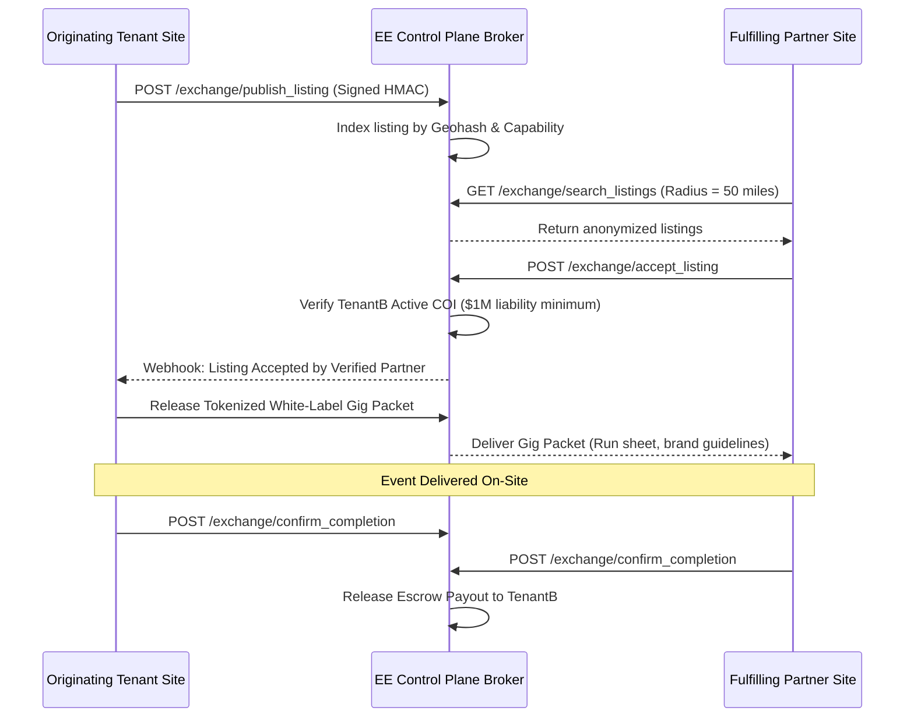

# Design: B2B Overflow & Sub-Rental Gear Exchange

## 1. Overview
The B2B Exchange enables peer operators on Entertainment Express to safely buy and sell overflow booking capacity and cross-rent specialized gear. Mediation occurs strictly through the EE Control Plane broker, protecting client non-solicitation, verifying partner liability insurance, and automating margin escrow without violating site multi-tenant isolation.

## 2. Architecture & Data Flow

## 3. Data Models

### Tenant Site DocType: `EE Exchange Listing`
- `booking_reference` (Link to Event Booking, optional)
- `listing_type` (Select: `Overflow Gig`, `Gear Sub-Rental`)
- `category` (Select: `DJ/MC`, `Inflatables`, `Photo Booth`, `Lighting/AV`, `Performers`)
- `event_date` (Date)
- `duration_hours` (Float)
- `payout_budget` (Currency)
- `venue_city` (Data)
- `venue_state` (Data)
- `venue_zip` (Data)
- `required_coi_minimum` (Currency, default 1,000,000)
- `status` (Select: `Draft`, `Published`, `Assigned`, `Completed`, `Cancelled`)
- `control_plane_listing_id` (Data)

### Tenant Site DocType: `EE Exchange Transaction`
- `exchange_listing` (Link to EE Exchange Listing)
- `partner_tenant_id` (Data, masked/hashed)
- `escrow_amount` (Currency)
- `escrow_status` (Select: `Pledged`, `Held`, `Disbursed`, `Disputed`)
- `white_label_packet_url` (Data)
- `completion_signoff_origin` (Check, default 0)
- `completion_signoff_partner` (Check, default 0)

## 4. API Endpoints (Tenant Side)

### 1. `entertainment_express.exchange.client.publish_overflow_job`
- Serializes booking details into an anonymized public listing.
- Signs payload with tenant's control-plane secret key.
- Posts to Control Plane and stores `control_plane_listing_id`.

### 2. `entertainment_express.exchange.client.browse_network_listings`
- Queries Control Plane broker for active listings within tenant's service radius.

### 3. `entertainment_express.exchange.client.accept_network_job`
- Validates local COI compliance before dispatching acceptance to Control Plane.

### 4. `entertainment_express.exchange.escrow.complete_and_release_escrow`
- Handles mutual sign-off and triggers purchase invoice / settlement entry.

## 5. UI Implementation
- `/owner/exchange`: Tabbed marketplace view:
  - **Available Opportunities**: Grid of regional gigs and equipment requests with 1-click "Claim Gig" CTA.
  - **My Posted Listings**: Manage active broadcasts and partner applications.
  - **Active Network Jobs**: Run sheets, white-label packet downloads, and completion sign-off.
