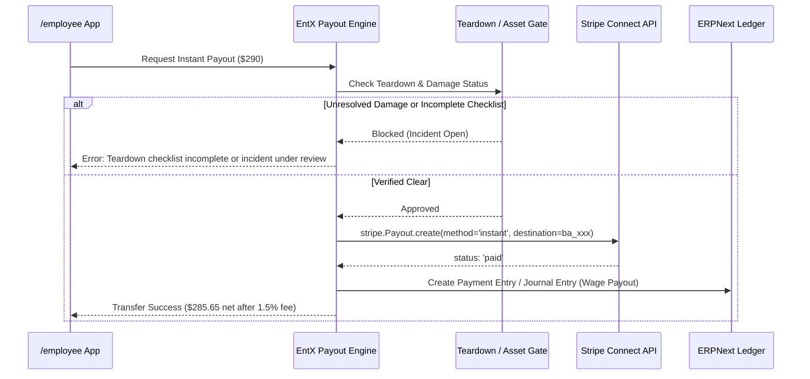

# Design: Crew Instant Payouts & Micro-Incentives

## 1. Overview
This design embeds fintech payout services and algorithmic worker performance scoring into Entertainment Express. Workers earn instant access to gig wages and tip pools upon damage-free event teardown, and build verifiable reliability track records that increase their dispatch priority.

## 2. Architecture & Payment Flow

## 3. Data Models

### New DocType: `EE Instant Payout`
- `worker` (Link to EE Worker Profile, reqd)
- `event_booking` (Link to Event Booking, reqd)
- `amount` (Currency, reqd)
- `fee_deducted` (Currency)
- `net_payout` (Currency)
- `stripe_payout_id` (Data)
- `status` (Select: `Pending`, `Processing`, `Paid`, `Failed`, `Blocked`)
- `failure_reason` (Small Text)
- `payout_timestamp` (Datetime)

### Schema Extensions: `EE Worker Profile`
- `stripe_connect_account_id` (Data)
- `instant_payout_eligible` (Check, default 0)
- `reliability_score` (Float, default 100.0)
- `punctuality_rating` (Float)
- `checklist_fidelity_rating` (Float)
- `asset_care_rating` (Float)
- `csat_rating` (Float)
- `total_events_completed` (Int, default 0)
- `tier` (Select: `Standard`, `Silver`, `Gold`, `Platinum`)

## 4. Reliability Algorithm Specification

The reliability rating $R$ is evaluated on a $0 - 100$ scale:
$$R = 0.40 \times P + 0.25 \times C + 0.20 \times A + 0.15 \times S$$

Where:
- $P$ (Punctuality): Percentage of shifts arrived within $\le 5$ minutes of call time via GPS geofence.
- $C$ (Checklist Fidelity): Percentage of required equipment load-out and return items digitally verified.
- $A$ (Asset Care): $100 - (20 \times \text{attributed gear damage incidents in trailing 12 months})$.
- $S$ (Survey CSAT): Normalized $0–100$ score from client 5-star event reviews.

## 5. API Endpoints

### 1. `entertainment_express.payouts.instant_transfer.get_available_payout_balance`
- Returns worker's unpaid earnings, tip allocations, and eligibility status for a specific booking or pay period.

### 2. `entertainment_express.payouts.instant_transfer.execute_instant_payout`
- Verifies post-event sign-off gate.
- Triggers Stripe Instant Payout.
- Records `EE Instant Payout` and reconciles against ERPNext.

### 3. `entertainment_express.payouts.reliability_engine.recompute_worker_reliability`
- Re-evaluates ratings across all vectors and updates profile tier.

## 6. UI Implementation
- `/employee/earnings`: Instant Payout banner with animated transfer button, itemized pay breakdown, and Stripe Connect onboarding status.
- `/owner/talent`: Crew Reliability Leaderboard with filterable score breakdown, punctuality stats, and tier badges.
