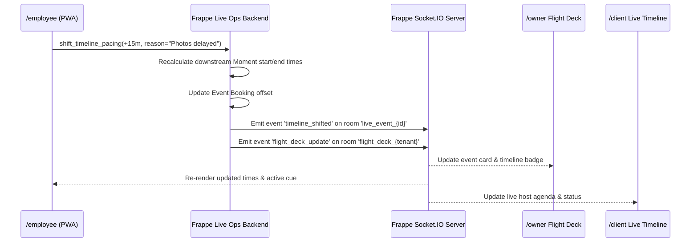

# Design: Live Event Flight Deck & Dynamic Timeline Pacing

## 1. Overview
This design implements a mission-control operations center for `/owner` and an interactive live-day execution console for `/employee` and `/client`. It synchronizes vehicle locations, crew geofence check-ins, dynamic timeline moment pacing, and field hardware incidents in real-time.

## 2. Architecture & Real-Time Flow

## 3. Data Models

### New DocType: `EE Live Incident`
- `event_booking` (Link to Event Booking, reqd)
- `reported_by` (Link to User)
- `incident_time` (Datetime)
- `severity` (Select: `Minor`, `Major`, `Critical`)
- `category` (Select: `Audio/Visual Equipment`, `Vehicle/Transit`, `Power/Venue`, `Staffing/Talent`, `Client/Guest Issue`)
- `asset` (Link to Item / Asset, optional)
- `description` (Small Text)
- `status` (Select: `Open`, `Acknowledged`, `Resolving`, `Resolved`)
- `resolution_notes` (Small Text)

### Event Booking Extensions
- `live_status` (Select: `scheduled`, `dispatched`, `en_route`, `on_site`, `rigging`, `soundcheck`, `show_live`, `teardown`, `cleared`)
- `last_geofence_lat` (Float)
- `last_geofence_lng` (Float)
- `last_geofence_time` (Datetime)
- `active_timeline_offset_minutes` (Int, default 0)
- `has_active_incidents` (Check, default 0)

### Event Timeline Moment Extensions
- `original_start_time` (Time)
- `original_end_time` (Time)
- `live_start_time` (Time)
- `live_end_time` (Time)
- `is_live_now` (Check, default 0)
- `is_completed` (Check, default 0)

## 4. API Endpoints

### 1. `entertainment_express.live_ops.flight_deck.get_active_flight_deck`
- Returns array of active bookings with venue lat/lng, live_status, crew assignments, current moment, offset minutes, and open incidents.

### 2. `entertainment_express.live_ops.flight_deck.update_field_milestone`
- Accepts `booking_name`, `new_status`, `latitude`, `longitude`.
- Computes Haversine distance against venue coordinates. If within radius (default 300m) or if override provided, updates `live_status` and broadcasts update.

### 3. `entertainment_express.live_ops.timeline_pacing.shift_timeline_pacing`
- Accepts `booking_name`, `offset_minutes` (int), `reason` (str).
- Recalculates all downstream moments where `is_completed == 0`.
- Broadcasts real-time Socket.IO payload to room `live_event_{booking_name}`.

### 4. `entertainment_express.live_ops.incident_desk.report_incident`
- Accepts `booking_name`, `severity`, `category`, `description`, `asset`.
- Inserts `EE Live Incident`, notifies admins, updates booking status.

## 5. UI Architecture

- **Owner Flight Deck (`/owner/flight-deck`)**:
  - Interactive Leaflet/MapLibre map with custom vehicle/venue pins.
  - Kanban / status strip grouping events by milestone (`En Route`, `Rigging`, `Live`, `Teardown`).
  - Incident banner queue with audio chime and 1-click resolve modal.
- **Employee Live Day View (`/employee/live/:id`)**:
  - Large-touch milestone progression button (e.g. "Tap to Confirm On-Site Arrival").
  - Pacing controller: `[-15m] [-5m] [+5m] [+15m] [+30m]` offset buttons.
  - Emergency 1-tap "Report Issue" action button.
- **Client Live View (`/client/live`)**:
  - Ambient timeline viewer displaying current moment in real-time, venue weather, and direct host contact.
