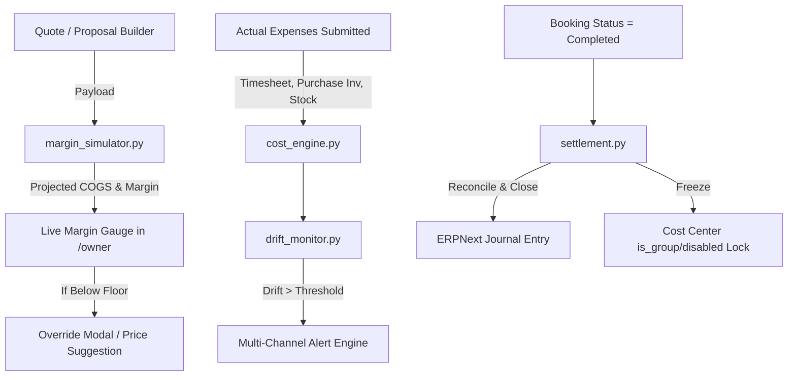

# Design: Predictive Margin Guardrails

## 1. Overview
Predictive Margin Guardrails establishes pre-event financial forecasting, real-time margin drift monitoring, and post-event ERPNext cost center locking to eliminate quote underpricing and retroactive margin decay.

## 2. Architecture & Data Flow

## 3. Data Models & Schema Updates

### Event Cost Sheet (`DocType`)
- `projected_gross_revenue` (Currency)
- `projected_labor_cost` (Currency)
- `projected_subcontractor_cost` (Currency)
- `projected_consumable_cost` (Currency)
- `projected_equipment_wear` (Currency)
- `projected_gateway_fees` (Currency)
- `projected_total_cogs` (Currency)
- `projected_net_profit` (Currency)
- `projected_margin_percent` (Percent)
- `margin_drift_percent` (Percent, computed as `projected_margin_percent - margin_percent`)
- `is_ledger_locked` (Check, default 0)
- `locked_at` (Datetime)
- `locked_by` (Link to User)
- `settlement_journal_entry` (Link to Journal Entry)

### EE Portal Settings (`Single DocType`)
- `minimum_margin_floor_percent` (Percent, default 35.0%)
- `margin_drift_warning_threshold` (Percent, default 5.0%)
- `auto_lock_cost_center_days` (Int, default 7)

## 4. API Surface

### 1. `entertainment_express.job_costing.margin_simulator.simulate_quote_margin`
- **Method**: POST
- **Input**:
  - `grand_total`: Float
  - `packages`: List[dict] (item_code, qty, rate)
  - `crew_roles`: List[dict] (role, hours, count)
  - `distance_miles`: Float
  - `sub_rentals`: List[dict] (cost, vendor)
  - `payment_method`: str (card / ach)
- **Output**:
  - `projected_cogs`: dict breakdown (labor, gear, transport, gateway, sub)
  - `projected_net_profit`: Float
  - `projected_margin_percent`: Float
  - `is_below_floor`: Boolean
  - `recommended_price`: Float

### 2. `entertainment_express.job_costing.settlement.settle_event_cost_center`
- **Method**: POST
- **Input**: `booking_name`: str, `force`: bool
- **Output**: `journal_entry`: str, `locked`: bool, `final_margin`: float

## 5. UI Components in `/owner`
- `MarginSimulationMeter.tsx`: Radial gauge showing projected margin % with green/amber/red zones and recommended price helper.
- `MarginDriftBanner.tsx`: Alert component displayed on `/owner/pipeline/:id` and `/owner/money` when drift exceeds threshold.
- `LedgerLockBadge.tsx`: Visual badge indicating locked/open accounting state with 1-click settlement CTA.
