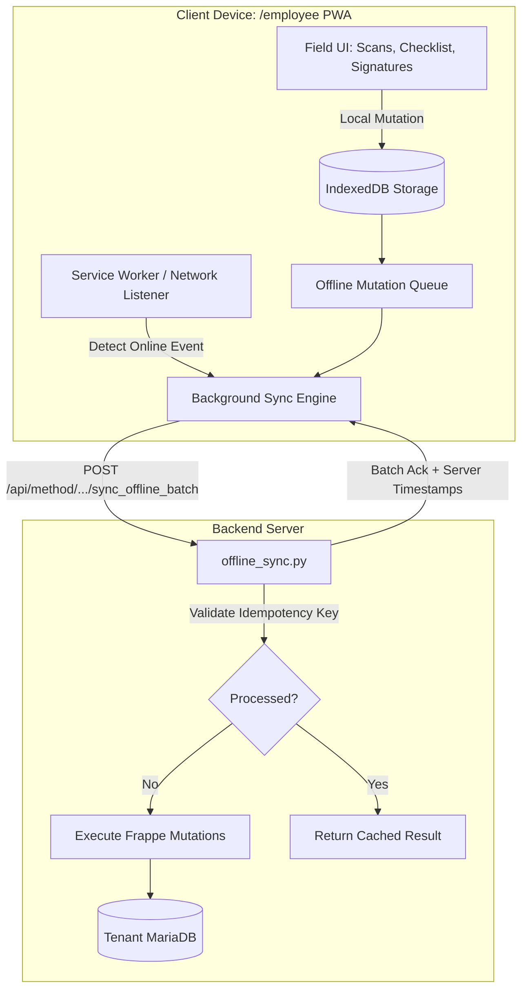

# Design: Zero-Signal Offline-First Field Hardening

## 1. Overview
This design upgrades the `/employee` field Progressive Web App into a true offline-first operational client. Field crew can execute complete setup, load-out, teardown, and signing workflows in signal dead-zones, with guaranteed local persistence and automated background sync upon reconnection.

## 2. Architecture & Offline Sync Flow



## 3. Data Models & Local Storage

### Local IndexedDB Schema (Dexie.js)
- `manifests`: Stores active day bookings, client names, venue coordinates, call times, and assigned assets.
- `items`: Serialized equipment and inventory bar codes with item codes and descriptions.
- `mutationQueue`:
  - `id`: Auto-increment int
  - `mutation_uuid`: UUID v4 (idempotency key)
  - `endpoint`: str (e.g. `log_barcode_scan`, `submit_waiver_signature`, `clock_timesheet`)
  - `payload`: Object
  - `client_timestamp`: Datetime ISO
  - `retry_count`: Int
  - `status`: `pending`, `syncing`, `failed`
- `mediaBlobs`: High-resolution photos stored as binary Blobs with metadata tags.

### Backend DocType: `EE Offline Sync Log`
- `client_uuid` (Data, unique index)
- `worker` (Link to User)
- `booking` (Link to Event Booking, optional)
- `action_type` (Data)
- `processed_at` (Datetime)
- `status` (Select: `Success`, `Merged`, `Rejected`)
- `error_message` (Small Text)

## 4. API Endpoints

### 1. `entertainment_express.api.offline_sync.get_day_offline_manifest`
- Pre-caches entire day operational package (bookings, gear lists, run-of-show cues, emergency contacts) for authenticated worker.
- Called automatically on app open when online.

### 2. `entertainment_express.api.offline_sync.sync_offline_batch`
- Accepts batch array of mutations:
  ```json
  {
    "mutations": [
      {
        "mutation_uuid": "f81d4fae-7dec-11d0-a765-00a0c91e6bf6",
        "action": "scan_asset_loaded",
        "booking": "EB-2026-009",
        "barcode": "EQ-SPK-0042",
        "client_timestamp": "2026-09-16T18:42:10Z"
      }
    ]
  }
  ```
- Evaluates idempotency via `EE Offline Sync Log`.
- Executes transactional updates in MariaDB and returns status per mutation.

## 5. UI Implementation
- `/employee`:
  - `SyncStatusPill.tsx`: Fixed header badge with live states:
    - 🟢 Online (Synced)
    - 🟡 Offline (5 pending changes)
    - 🔵 Syncing (Flushing mutations...)
  - `OfflineInspectorDrawer.tsx`: Allows workers to view queued changes, retry failed requests, or inspect storage usage.
